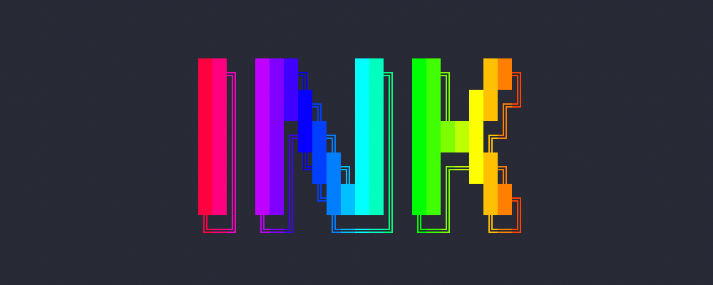

export { default as themes } from "./theme.js";

import { Head, Appear, Notes, Image } from "mdx-deck";
import { Twemoji as Emoji } from "react-emoji-render";
import QRCode from "qrcode.react";

import Mono from "./Mono.js";

<Head>
  <title>React for Command-Line Interfaces! (feat. Ink)</title>
  <meta name="twitter:card" content="summary_large_image" />
  <meta name="twitter:site" content="@hexrcs" />
  <meta name="twitter:title" content="React for Command-Line Interfaces! (feat. Ink)" />
  <meta
    name="twitter:description"
    content="Text-based CLI tools are great. They are fast, lightweight, and universally accessible. But what does CLI have to do with React? In this lightning talk, we will have a look at Ink - a wonderful custom React renderer that allows us to use Flexbox to create excellent command-line interfaces with ease. Want to create a companion CLI tool for the next big thing that you are working on? Build it with React!"
  />
  <meta
    name="twitter:image"
    content="https://reactdayberlin-node-cli-talk.netlify.com/cover.png"
  />
  <link
    rel="stylesheet"
    href="https://cdn.jsdelivr.net/gh/tonsky/FiraCode@1.207/distr/fira_code.css"
  />
</Head>

# React for Command-Line Interfaces!

<h2><i>feat. Ink <Emoji svg text="🌈" /></i></h2>
<h2></h2>

<Mono>@hexrcs</Mono>

---

import Small from "./Small.js";

<Emoji svg text="Hi there! :wave:" />

## My name is Xiaoru Li <Emoji svg text="🇨🇳" />

You can also call me _Leo_

##### *Studying CS in Karlsruhe, Germany*

<Small>I post crash course threads on Twitter as @hexrcs</Small>
<br/>
<Small>And video tutorials on methodcoder.com <Emoji svg text="😄" /></Small>

---

# Command-Line Interfaces

---

# CLIs and terminals have been with us since the 60s

# It's almost 2020, so why? <Emoji svg text="🤔" />

---
  <h1>
    Old, but not obsolete <Emoji svg text="💡" />
  </h1>
<Appear>
  <div>
     <h3><i>Think git, CRA, test runners...</i></h3>
     <h2>Practical, fast, developer-friendly!</h2>
  </div>
  <h2>Your next big project might need a CLI companion!</h2>
</Appear>

---

# How do we start

## building a CLI app with Node?

<Notes>surprisingly easy</Notes>

---

We start simple...

```js
console.log("Hello World!");
```

then run  <i> `node index.js`</i>

# <Emoji svg text=":D" />

<Notes>
save to a JS file, ask node to run that line of code.

one <strong>IMPORTANT</strong> thing to keep in mind is that this console is not hidden in the devtools, it's the place users interact with our application.

</Notes>

---

## But how can we make things more interesting?

---

# ANSI escape code

<Mono big>ANSI === "American National Standards Institute"</Mono>

<Appear>
  <h3>
    Bold, italics, colors, updates...
  </h3>
  <h3>
    Boy they are ugly <Emoji svg text="😅" />
  </h3>
</Appear>

---

## If we want to print colored text... <Emoji svg text="🤔" />

---

import ReactDayBerlin from "./ReactDayBerlin.js";

```js
console.log(
  "\u001b[44m" + // Blue background
  "\u001b[37m" + // White text
  "\u001b[1m" + // Bold font
  "ReactDay" + // Payload 1
  "\u001b[47m" + // White background
  "\u001b[31m" + // Red text
  "Berlin" + // Payload 2
    "\u001b[0m" // Reset styling
);
```

<div
  style={{
    display: "flex",
    flexDirection: "row",
    alignItems: "center",
    justifyContent: "center",
  }}
>
  <h2 style={{ margin: "5rem" }}>
    <Emoji svg text="👉" />
  </h2>
  <ReactDayBerlin />
</div>

<Notes>
Just to print something like this to the console, we need this
</Notes>

---

## If we want to update printed text... <Emoji svg text="🤔" />

<Notes>
transition: And there are ANSI escape code exactly for this purpose...

</Notes>

---

### A simple clock

```js
function simpleClock() {
  setInterval(() => {
    const time = moment().format("h:mm:ss a");
    process.stdout.write("\u001b[1000D\u001b[K");
    process.stdout.write(time);
  }, 1000);
}
```

Move 1000 columns to the left, remove everything till end of the line

---

### Layouts in a pure text environment are even tougher <Emoji svg text="😕" />

### And we want to update multiple chunks simultaneously... <Emoji svg text="😂" />

---

### Jest's running and watch mode

<div
  dangerouslySetInnerHTML={{
    __html: `
      <video
        style="max-width: 60%"
        loop
        autoplay
        muted
        src="./images/jest.mp4"
      />
    `,
  }}
/>

Real time status <Emoji svg text="🧭" /> Keyboard interaction <Emoji svg text="👨‍💻" />

---

## Behold, we have `Ink`! <Emoji svg text="🌈" />



*from @vadimdemedes and @sindresorhus*

<Appear>
  <div style={{ marginTop: "4em" }}>
    <h3>
      <Emoji svg text="✅" /> Custom React renderer
    </h3>
    <h3>
      <Emoji svg text="✅" /> Flexbox magic in the terminal <Emoji svg text="🤯" />
    </h3>
  </div>
</Appear>

---

```jsx
import React, { useEffect, useState } from "react";
import { Text, Box, Color, useInput, render } from "ink";
import Gradient from "ink-gradient";
import BigText from "ink-big-text";
import Spinner from "ink-spinner";
import TextInput from "ink-text-input";
import Ascii from "ink-ascii";
```

Import built-in 3rd party Ink components <Emoji svg text="☝️" />

<Notes>
There are also pre-built 3rd party components, which are specialized at making colorful text or capturing keystokes, making our life much easier

NOTE that if you are using TS, the imports have to be transpiled to the conventional commonjs "require" to be understood by Node.

</Notes>

---

## An example?


---

```jsx
const AppContext = createContext();
const Wiki = () => {
  // init keypress handling, useStates and so on...
  return (
    <AppContext.Provider value={{ ...statesAndSetters }}>
      <Box flexDirection="column" marginY={1}>
        <InstantSearchBar />
        <ResultsListing />
        <StatusInfoBar />
      </Box>
    </AppContext.Provider>
  );
};

render(<Wiki />);
```

Just like building any React app <Emoji svg text="☝️" />


---

<div
  dangerouslySetInnerHTML={{
    __html: `
      <video
        style="height: 90vh;"
        loop
        autoplay
        muted
        src="./images/demo-wiki.mp4"
      />
    `,
  }}
/>

---

<Image src="./images/ink-users.png" size="contain" />

<Notes>
  So Ink Version 2 was released in about March this year

  Many big projects like Gatsby, npm have already started using it.
</Notes>

---

### More awesomeness with Ink

<Image src="./images/ink-mdx.png" style={{height: "70vh", width: "70vw"}} size="contain" />

MDX rendered directly to the terminal!

---

### Even more awesomeness with Ink

<Appear>
<Image src="./images/pastel-logo.png" style={{height: "50vh", width: "50vw"}} size="contain" />
</Appear>

<Notes>
We've been mainly focusing on dynamic user interfaces tonight, but in many cases we actually want as little user interaction with the program as possible, which helps with automation.

Pastel is a framework based on Ink, which looks at how the source code files are structured, then it will use the project structure as its API, very similar to the way you write routes for Next.js.
</Notes>

---

```text
git-js/
  - package.json
  - commands/
    - index.js
    - add.js
    - checkout.js
    - commit.js
    - stash/
      - index.js
      - clear.js
      - pop.js
        ...
```

`git stash pop` anyone?

<Notes>
This is particularly useful for building an app with commands and subcommands like git. You can nest directories, and pastel will convert the hierarchy into nested commands. The logic of each command is encapsulated its own React component, so you have a completely modularized application.

The option and flags passed to the command will be fed into the React component as props.

Super cool.

</Notes>

---

## Check out `react-blessed` too!

### Renders to `blessed` widgets

### More suitable for fullscreen apps

---

<Image src="./images/thats-all-folks.png" size="contain" />

---

# Thank you! <Emoji svg text="🙌" />

Source code of slides and demos can be found here <Emoji svg text="👇" />

<div
  style={{
    display: "flex",
    justifyContent: "center",
  }}
>
  <div
    style={{
      padding: "1rem",
      backgroundColor: "white",
    }}
  >
    <QRCode
      value="https://github.com/hexrcs/201912-rdberlin-node-cli-talk"
      size={500}
    />
  </div>
</div>

`https://github.com/hexrcs/201912-rdberlin-node-cli-talk`


---

### Links and Acknowledgements

NPM modules

- [Ink](https://github.com/vadimdemedes/ink)
- [Pastel](https://github.com/vadimdemedes/pastel)
- [React Blessed](https://github.com/Yomguithereal/react-blessed)

Articles

- [Awesome List - Node CLI utils](https://github.com/sindresorhus/awesome-nodejs#command-line-utilities)
- [More about ANSI escape code](https://en.wikipedia.org/wiki/ANSI_escape_code)
- [A great article on building vanilla CLI tools with Python](http://www.lihaoyi.com/post/BuildyourownCommandLinewithANSIescapecodes.html)
- [Render MDX to the Terminal with Ink](https://mdxjs.com/guides/terminal)

Images

- [That's all folks](https://twitter.com/ontariocofc/status/803779593631105024)
